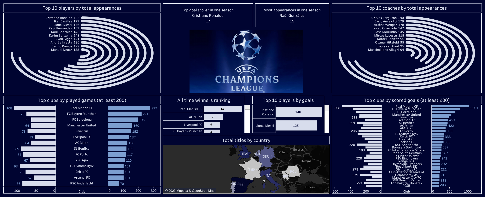

# UEFA-Champions-League

---

In my latest data analysis endeavor, I set out to explore the dynamic world of the UEFA Champions League. With a passion for both football and data-driven insights, I embarked on a journey to unlock the hidden stories behind this prestigious tournament. To do this, I harnessed the comprehensive 'Champions League era stats' dataset, which you can find **[here](https://www.kaggle.com/datasets/basharalkuwaiti/champions-league-era-stats).** This dataset covers statistics up to the group stage of the 2021/22 season, offering a treasure trove of information on club participation, player records, coaching legacies, and more.

Through meticulous data cleaning and transformation, I turned raw data into a series of compelling visualizations that highlight various facets of the Champions League's modern era. You can explore the culmination of this effort in my interactive dashboard, hosted on Tableau Public, which you can access **[here](https://public.tableau.com/views/UEFAChampionsLeague_16937530478560/Dashboard1?:language=en-US&:display_count=n&:origin=viz_share_link).** This dashboard seamlessly integrates visualizations such as radial bar charts, horizontal bar charts, maps, and text sheets to offer an immersive experience into the tournament's history.
​

One of the project's highlights includes visualizations like ***'Top 10 Players by Total Appearances'*** and ***'Top 10 Coaches by Total Appearances'***, revealing the legends who have made their mark on the Champions League. The ***'Total Titles by Country'*** map provides a global perspective on the tournament's success, while the ***'All-Time Winners Ranking'*** showcases the most illustrious clubs in the competition's history.

All these individual visualizations have been seamlessly combined into a single, cohesive dashboard, creating a comprehensive resource for football enthusiasts and data enthusiasts alike.

This project offers an engaging journey through the UEFA Champions League's modern era, providing captivating insights and a newfound appreciation for the world's most prestigious club football competition. Explore the magic of the Champions League through data, and join me on this immersive experience.
